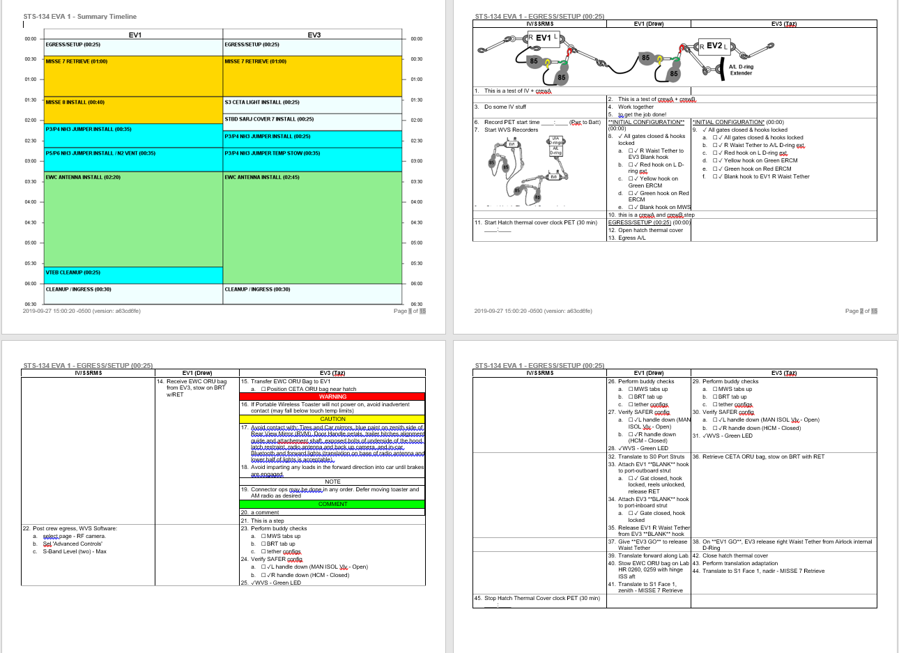

<h1 align="center">Maestro</h1>

<h5 align="center">Composing procedures for space operations</h5>

<div align="center">
  <a href="https://travis-ci.org/xoperations/maestro">
    
  </a>
  <a href="https://codeclimate.com/github/xOPERATIONS/maestro/maintainability">
    
  </a>
  <a href="https://codeclimate.com/github/xOPERATIONS/maestro/test_coverage">
    
  </a>

  <br />
  

</div>

<br />

## Purpose

The purpose of Maestro is to replace the manual procedure creation process for Extravehicular Activities (EVAs, AKA "spacewalks") by NASA* personnel. The goal of the application is to be able to write EVA procedures as simple YAML files and run `maestro compose` to generate Word or other documents in a standardized procedure format, similar to the Space Shuttle mission "STS-134" procedures found on page `FS 7-20` of [this document](https://www.nasa.gov/centers/johnson/pdf/539922main_EVA_134_F_A.pdf). More EVAs can be found at the [FOIA archive](https://www.nasa.gov/centers/johnson/news/flightdatafiles/foia_archive.html).

<sub>_* This is an independent project and is unaffiliated with NASA_</sub>

## Usage

The `maestro compose` command can be used within a valid Maestro project, such as those listed in the "examples" section below. A Maestro project consists of at least:

1. A `procedures` directory containing at least one `.yml` file defining a procedure
2. A `tasks` directory containing the task `.yml` files defined within the procedure file

Running `maestro compose` will generate an MS Word DOCX procedure file that looks something like this:



Other formats are also available:

- `maestro compose --no-eva-docx` prevents generating the default multi-column (EVA) format
- `maestro compose --sodf` generates a more serial version of the procedure
- `maestro compose --html` generates an HTML version of the EVA format
- Future output will support domain-specific formats

### Serving HTML

Ultimately Maestro will include a web application for composing and conducting procedures. For now,
simply viewing the HTML versions of procedures can be achieved by doing:

```bash
maestro compose --html           # This generates HTML versions of procedures
maestro conduct
```

To specify port, do `maestro conduct --port=8080`.

## Examples

- Maestro generating STS-134 procedures using GitLab CI: https://gitlab.com/xOPERATIONS/sts-134

## Installation

Maestro is under heavy development. While it's possible to `npm install -g xops-pat` the versions within NPM may be out of date. It's better to do the following:

### Install for dev purposes

1. Install Node.JS
2. Clone this repo, then run `npm install` within it
3. Setup the `maestro` command by doing `npm link`
4. Test it out on a Maestro project

## Goals

1. Procedures can represent multiple actors performing actions in parallel
2. An output format has to look pretty close to current EVA procedures (otherwise it will be too hard to force a culture change within the community).
3. Procedure authors should not need to worry about formatting at all (the system enforces standards)
4. Procedure authors should be able to easily receive changes from contributors and accept, reject, or request updates
5. Procedure authors should be able to easily diff changes between arbitrary versions of procedures
6. Editing a procedure should be as easy as editing one in MS Word. On face value this seems like a difficult requirement, but in reality formatting hardships with Word are a big driver for finding a better solution. Editing the raw YAML files is doable and preferable for some users, but for those

## Future features

Below are future desired features, in approximate order of priority.

1. High-level procedure editor ([#37](https://github.com/xOPERATIONS/maestro/issues/37), currently under development by UMUC students): This will not perform editing of steps, but will allow for reorganization of tasks, adjusting task durations, etc.
2. Modules ([#42](https://github.com/xOPERATIONS/maestro/issues/42)): Pre-built step-generators. Just supply inputs, get the standards-compliant step text
3. Variables ([#43](https://github.com/xOPERATIONS/maestro/issues/43)): Certain values may be repeated many times throughout a procedure. Capture them as variables.
4. Package/dependency manager ([#21](https://github.com/xOPERATIONS/maestro/issues/21)): Allow reuse of common elements (e.g. egressing the airlock) or sharing tasks (two EVAs may carry the same task)
5. Track state ([#44](https://github.com/xOPERATIONS/maestro/issues/44)): During spacewalks, the crew move and reconfigure things. Maestro should be able to track this.
6. Full editor: Edit all steps, handling modules, variables, state, etc, and integrate with GitLab (GitLab is used internally).

## Definitions

Maestro uses several terms like "actors", "roles", and "tasks". These need better definition.

## Videos

Old videos exist [here](https://www.youtube.com/watch?v=l8NPJTH6QzU), [here](https://www.youtube.com/watch?v=G60tPv9cM08), and [here](https://www.youtube.com/watch?v=uTopcel6VpA). These are probably out of date. New ones coming soon.

## API Reference

Build API docs into the `.api-docs` directory by running `./node_modules/jsdoc/jsdoc.js -c ./.jsdoc.json .`. At the time of this writing the docs are pretty minimal and poorly linked, but will hopefully improve with time.

Libraries used include nunjucks for HTML/CSS template customization, chai assertion for unit testing, and pandoc for HTML-to-Word file conversion.

See [YAML Definition](docs/yamlDefinition.md) for an overview of YAML file syntax. This link also provides details on how NASA JSC writes procedures in the YAML files format for EVA Tasks and how the EVA Task Generator uses the data dictionary to parse YAML files.

## Tests

### Unit Testing & linting

A pre-commit hook is in place forcing linting, style, and unit testing to all pass prior to making commits.

## Credits

### Project Sponsor

James Montalvo

### UMUC Phase III Development Team, Fall 2019

TBD

### UMUC Phase II Development Team, Spring 2019

- Akruthi Shetty
- Christopher Redding
- Ebony Christian
- Joe Bidinger
- Ted Deloggio

### UMUC Phase I Development Team, Fall 2018

- Jose De la Cruz
- Jason Foley
- Alexandra Kuntz
- Engedawork Befekadu
- Timothy Smith
- Christopher Drury
- Kevin Terry
- John-Carlo Babin
